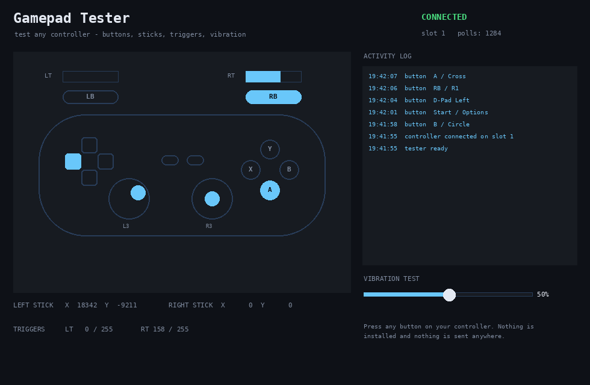

# Gamepad Tester

💬 **More free Windows software & updates:** [Telegram — **@windows_free_software**](https://t.me/windows_free_software)

**Gamepad Tester** — a **free gamepad tester for Windows 10 / 11**. Check every button, stick
and trigger on your controller in seconds, and test the vibration motors — without installing
anything.

Use it to find out **why your controller is not working**, to check a **used gamepad before
buying**, to spot **stick drift**, a dead trigger or a stuck button, and to confirm that
vibration still works.

## Features

- 🎮 **Works with any XInput controller** — Xbox, PlayStation via driver, Switch Pro, generic pads
- 🔘 **Live button map** — every press lights up on screen instantly
- 🕹️ **Stick readout** — raw X/Y values, so **stick drift** is obvious
- 🎚️ **Trigger bars** — analog value from 0 to 255, catches a dead or half-stuck trigger
- 📳 **Vibration test** — drive both motors with a slider
- 📋 **Activity log** — timestamped list of every press, useful for a **stuck button**
- 🔌 **Auto-detects** the controller and the slot it sits in, USB or Bluetooth
- 🪶 **Portable** — single file, no installer, no admin rights, no drivers
- 🔒 **Read-only** — the app never emulates input, it only reads the pad
- 🆓 **Free & open** — MIT licensed, zero ads, zero telemetry

## How to use

1. Download `GamepadTester.zip` from [Releases](../../releases/latest) and unzip it.
2. Connect your controller by USB or Bluetooth.
3. Run `GamepadTester.exe` — it finds the pad automatically.
4. Press buttons, move the sticks, pull the triggers — everything lights up on screen.
5. Drag the vibration slider to test both motors.

## How to check for stick drift

Put the controller down and do not touch it. If the **LEFT STICK** or **RIGHT STICK** values
are not close to zero — or the dot on screen keeps moving on its own — that stick is drifting.

## Requirements

- Windows 10 or Windows 11 (64-bit)
- No .NET runtime to install, no drivers, no admin rights

The binary is not code-signed, so SmartScreen may warn on first run:
**More info → Run anyway**.

## FAQ

**Which controllers are supported?**
Anything Windows exposes through XInput: Xbox pads, most third-party gamepads, PlayStation
controllers with a driver like DS4Windows, Switch Pro in XInput mode.

**Does it change anything on my PC?**
No. It only reads the controller state and can drive the vibration motors. Nothing is installed.

**Will it work over Bluetooth?**
Yes, as long as Windows already sees the controller.

**My controller is not detected.**
Check that it appears in Windows Game Controllers. If it uses DirectInput only, a wrapper
like DS4Windows will expose it as XInput.

**Keywords:** gamepad tester, controller tester windows, xbox controller test, joystick test,
stick drift test, gamepad button test, vibration test, controller diagnostics.

---

Not affiliated with or endorsed by Microsoft, Sony or Nintendo.
